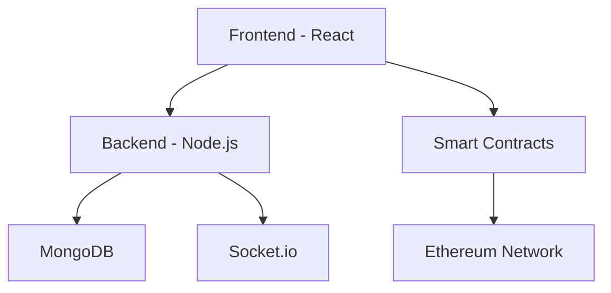

# LEARN.md - W3nity Contributor Guide

## 📚 Table of Contents

1. [Project Overview](#project-overview)
2. [Architecture & Design](#architecture--design)
3. [Development Setup](#development-setup)
4. [Code Structure Deep Dive](#code-structure-deep-dive)
5. [Smart Contract Details](#smart-contract-details)
6. [Frontend Development](#frontend-development)
7. [Backend Architecture](#backend-architecture)
8. [Key Programming Concepts](#key-programming-concepts)
9. [Database & Performance](#database--performance)
10. [Testing Guidelines](#testing-guidelines)
11. [How to Extend the Project](#how-to-extend-the-project)
12. [Learning Path for Beginners](#learning-path-for-beginners)
13. [Troubleshooting](#troubleshooting)
14. [Contributing Guidelines](#contributing-guidelines)

## 🎯 Project Overview
W3nity is a decentralized platform for freelancing, event management, and community collaboration, powered by Web3 technologies. It leverages smart contracts for secure payments and NFT-based ticketing, and provides real-time communication features for users.

### Core Features
- **Event Management**: Create, manage, and sell NFT tickets for events
- **Freelance Marketplace**: Post gigs, submit proposals, and handle secure payments
- **Real-time Communication**: Chat system and instant notifications
- **Blockchain Integration**: Smart contracts for payments and ticketing
- **User Profiles**: Comprehensive profile management with ratings and portfolio

## 🏗️ Architecture & Design

### System Architecture


### Data Flow
1. User interactions trigger React components
2. API calls made to backend services
3. Smart contract interactions via ethers.js
4. Real-time updates via Socket.io
5. Data persistence in MongoDB

## 🏗️ Project Structure
```
W3nity/
├── client/                 # Frontend React application
│   ├── src/
│   │   ├── components/     # Reusable UI components
│   │   ├── hooks/          # Custom React hooks
│   │   ├── pages/          # Page components
│   │   ├── lib/            # Utilities and helpers
│   │   ├── types/          # TypeScript type definitions
│   │   └── socket.ts       # WebSocket configuration
│   ├── public/             # Static assets
│   └── .env                # Frontend environment variables
├── server/                 # Backend Node.js application
│   ├── controllers/        # Route controllers
│   ├── models/             # Database models
│   ├── routes/             # API routes
│   ├── listeners/          # Blockchain event listeners
│   └── .env                # Backend environment variables
├── contracts/              # Solidity smart contracts
│   ├── Escrow.sol          # Escrow contract for payments
│   └── EventTicketNFT.sol  # NFT contract for event tickets
├── scripts/                # Deployment and testing scripts
├── artifacts/              # Compiled contract artifacts
├── assets/                 # Project images and logos
├── cache/                  # Hardhat cache
├── test/                   # Smart contract tests
└── README.md, LEARN.md     # Project documentation
```

## 🚀 Key Features
- Event management with NFT ticketing
- Freelance gig posting and secure escrow payments
- Real-time chat and notifications
- Profile and project management
- Blockchain integration for transparency and security

## 💻 Technology Stack
- **Frontend:** React, TypeScript, Tailwind CSS, Ethers.js, Stripe
- **Backend:** Node.js, Express, MongoDB, Socket.io, JWT
- **Blockchain:** Solidity, Hardhat, OpenZeppelin, IPFS

## 🔧 Setup Instructions
1. **Clone the repository**
   ```bash
   git clone https://github.com/yourusername/W3nity.git
   cd W3nity
   ```
2. **Install dependencies**
   ```bash
   npm install
   cd client && npm install
   cd ../server && npm install
   ```
3. **Configure environment variables**
   - `client/.env`: `VITE_API_URL=http://localhost:8080`
   - `server/.env`: `PORT=8080`, `MONGO_URI=your_mongodb_uri`, `JWT_SECRET=your_secret_key`
4. **Start development servers**
   ```bash
   npx hardhat node
   cd server && npm run dev
   cd client && npm run dev
   ```

## 📦 Smart Contracts
- **EventTicketNFT.sol**: Handles NFT-based event ticketing
- **Escrow.sol**: Manages secure payments for gigs

## 📚 API Documentation

### Authentication Endpoints
```typescript
POST /api/auth/register
Body: {
    username: string
    email: string
    password: string
    role: "freelancer" | "client" | "organizer"
}

POST /api/auth/login
Body: {
    email: string
    password: string
}
```

### Event Endpoints
```typescript
GET /api/events
Query: {
    page?: number
    limit?: number
    category?: string
    search?: string
}

POST /api/events
Body: {
    title: string
    description: string
    date: Date
    price: number
    capacity: number
    location?: {
        type: "online" | "physical"
        address?: string
        link?: string
    }
}

GET /api/events/:id
Response: {
    _id: string
    title: string
    description: string
    organizer: User
    attendees: User[]
    ticketsSold: number
    // ... other event details
}
```

### Smart Contract Integration
```typescript
POST /api/events/:id/mint-ticket
Body: {
    wallet: string
    quantity: number
}
```

## 🧪 Testing Guidelines

### 1. Smart Contract Testing
```bash
# Run all tests
npx hardhat test

# Run specific test file
npx hardhat test test/EventTicketNFT.ts

# Get test coverage
npx hardhat coverage
```

### 2. Frontend Testing
```bash
cd client
npm test

# Watch mode
npm test -- --watch

# Coverage report
npm test -- --coverage
```

### 3. Backend Testing
```bash
cd server
npm test

# Run specific test suite
npm test -- --grep "Auth API"
```

### 4. Integration Testing
- End-to-end tests using Cypress
- API tests using Postman collections
- Smart contract integration tests
- **Smart Contracts:** `npx hardhat test`
- **Frontend:** `cd client && npm test`
- **Backend:** `cd server && npm test`

## 🔧 Development Workflow

### Branch Naming Convention
- Feature: `feature/description`
- Bugfix: `fix/description`
- Documentation: `docs/description`
- Testing: `test/description`

### Commit Message Format
```
type(scope): description

[optional body]

[optional footer]
```
Types: feat, fix, docs, style, refactor, test, chore

### Pull Request Process
1. Create feature branch from `main`
2. Implement changes with tests
3. Update documentation
4. Submit PR with detailed description
5. Address review comments
6. Squash and merge after approval

## 🐛 Troubleshooting Guide

### Common Issues

1. **Smart Contract Deployment**
```bash
Error: Cannot connect to network
Solution: Ensure Hardhat node is running
npx hardhat node
```

2. **MetaMask Connection**
```javascript
Error: Provider not found
Solution: Add network to MetaMask
{
    chainId: '0x7A69',
    chainName: 'Hardhat Local',
    rpcUrls: ['http://127.0.0.1:8545']
}
```

3. **MongoDB Connection**
```bash
Error: MongoNetworkError
Solution: Check MONGO_URI in .env
```

### Development Tips
- Use Hardhat Console for contract debugging
- Check MetaMask network and account
- Monitor MongoDB connection status
- Watch server logs for errors

## 🤝 Contributing Guidelines

### Before Contributing
1. Read the documentation thoroughly
2. Check existing issues and PRs
3. Join Discord for discussions
4. Set up development environment

### Development Standards
1. Follow TypeScript best practices
2. Write comprehensive tests
3. Document code changes
4. Update LEARN.md if needed

### Code Review Process
1. Self-review changes
2. Request review from maintainers
3. Address feedback promptly
4. Update PR as needed

## � Code Structure Deep Dive

### Frontend Component Structure
```tsx
// Example of a React Component Structure
const EventCard: React.FC<EventCardProps> = ({ event }) => {
    const [isLoading, setIsLoading] = useState(false);
    const { mintTicket } = useWeb3Contract();

    const handleMint = async () => {
        // Implementation details
    };

    return (
        <div className="card">
            {/* Component JSX */}
        </div>
    );
};
```

### CSS/Styling Patterns
```css
/* Tailwind Utility Pattern */
.button-primary {
    @apply px-4 py-2 bg-blue-600 text-white rounded-lg
    hover:bg-blue-700 transition-colors duration-200;
}

/* Component-specific styles */
.event-card {
    @apply flex flex-col p-4 border rounded-lg
    hover:shadow-lg transition-shadow duration-200;
}
```

### Smart Contract Patterns
```solidity
// Example of a Smart Contract Pattern
contract EventTicket is ERC721URIStorage {
    using Counters for Counters.Counter;
    Counters.Counter private _tokenIds;
    
    mapping(uint256 => bool) private _usedTickets;
    
    function mintTicket(address recipient) public returns (uint256) {
        // Implementation
    }
}
```

## 🎓 Learning Path for Beginners

### Phase 1: Foundations
1. **Web Development Basics**
   - HTML, CSS, JavaScript fundamentals
   - React basics and hooks
   - TypeScript essentials
   
2. **Blockchain Fundamentals**
   - Ethereum basics
   - Web3.js/Ethers.js
   - Smart contract concepts

### Phase 2: Core Technologies
1. **Frontend Development**
   - React components and state
   - TypeScript with React
   - Tailwind CSS

2. **Backend Development**
   - Node.js and Express
   - MongoDB and Mongoose
   - REST API design

3. **Smart Contracts**
   - Solidity basics
   - OpenZeppelin contracts
   - Testing with Hardhat

### Phase 3: Advanced Concepts
1. **Web3 Integration**
   - MetaMask integration
   - Contract interactions
   - Transaction handling

2. **Real-time Features**
   - Socket.io implementation
   - Real-time updates
   - Event handling

## 🚀 How to Extend the Project

### Beginner Extensions
1. **Add New Event Types**
```typescript
// Add to types/event.ts
interface EventType {
    type: 'conference' | 'workshop' | 'hackathon' | 'webinar';
    features: string[];
    pricing: PricingModel;
}
```

2. **Enhance User Profiles**
```typescript
// Add to models/User.ts
interface UserProfile {
    skills: string[];
    portfolio: Project[];
    ratings: Rating[];
}
```

### Intermediate Extensions
1. **Implement Token Gating**
```solidity
// Add to EventTicketNFT.sol
function isTokenGatedEvent(uint256 eventId) public view returns (bool) {
    // Implementation
}
```

2. **Add Analytics Dashboard**
```typescript
// Create new component
const AnalyticsDashboard: React.FC = () => {
    // Implementation
};
```

### Advanced Extensions
1. **DAO Governance**
2. **Layer 2 Integration**
3. **AI-powered Recommendations**
4. **Cross-chain Compatibility**

## �🔐 Security Considerations
- Uses OpenZeppelin contracts for best practices
- JWT authentication and input validation
- CORS and environment variable protection
- Regular security audits
- Input sanitization
- Rate limiting implementation
- XSS and CSRF protection

## 📞 Support
- Open a GitHub issue
- Join the Discord community

---
*Last updated: July 21, 2025*
